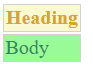

<h1 align="center">
web2xlsx
</h1>
<p align="center">Export any HTML table to .xlsx format</p>

<br>
<p align="center">
    
    
    
    
    
</p>

[comment]: # (Markdown page specially designed for GitHub)

## Table Of Contents
1. [Introduction](#versions)
2. [Features](#features)
3. [Importing](#importing)
    3. [Requirements](#requirements)
4. [Options](#options)
5. [Future Scope](#future-scope)
6. [Versions](#versions)

## Introduction
Web2xlsx is a javascript library which can be used to convert an HTML table to a .xlsx file which is then downloaded. This entire process happens in the client side. This library uses pre-existing and well maintained libraries: jQuery, FileSaver and ExcelJS. 

A lot of other similar libraries exist, but they either convert to .xls, or they do not support colors/font styles etc., or they are old, or paid. This library when imported into an existing web project gives one the ability to do the necessary conversion in very simple steps. 

I hope this script helps someone sometime. Any contributions or criticisms are welcome.

## Features

1. **Multiple Sheets** for multiple tables in same file
    1. With _Sheet names_
    1. And _Sheet Tab Colors_
2. Cell **Background colors**
3. Different **Font options**
    3. Font _Color_
    3. Font _Size_
    3. Font _Family_ (eg - Calibri, Sans etc.)
    3. _Bold/Italics/Underline_
4. **Exclude** certain **Rows and Columns**
5. **Column Widths**
    5. Ability to set _default width_ for all columns
    5. Ability to set _custom width_ for certain columns
6. Ability to **wrap text** in .xlsx 
7. Ability to **run functions** _before and after_ the process or individual conversions
8. _Console Log_ data for individual cells (value/colors/etc.) for **optional debugging**
9. Proper commenting if one chooses to understand or modify the code itself (uses JSDoc)

## Importing

#### Requirements
Before importing this script, one should import the following if they are unavailable in the project. 

_NOTE_: The order in which they are imported is important

1. [jQuery](https://github.com/jquery/jquery)
2. [FileSaver](https://github.com/eligrey/FileSaver.js/)
3. [[_Optional_] Polyfills](https://github.com/babel/babel/tree/master/packages/babel-polyfill)
4. [ExcelJS](https://github.com/exceljs/exceljs)
5. [**web2xlsx**](https://github.com/rajitroy/web2xlsx)

#### Location
|Type|Place|Comments|
|---|---|---|
|Github|./dist folder|Choose either the main js or the minified js file. Choose .min.js to save space if needed.|
|CDN|https://cdn.jsdelivr.net/gh/RajitRoy/web2xlsx@1.0/dist/web2xlsx.min.js|The version '@x.y' can be changed as needed. Be aware of jsDelivr's caches.|

#### An example import

_NOTE_: Be aware of the different versions of each script being imported. Unless necessary, simply import the latest version of each.

_NOTE_: The order in which they are imported is important


```html
<head>
    ...
    <script src="https://ajax.googleapis.com/ajax/libs/jquery/3.5.1/jquery.min.js"></script>
    <script src="https://cdn.jsdelivr.net/npm/file-saver@2.0.2/dist/FileSaver.min.js"></script>
    <script src="https://cdnjs.cloudflare.com/ajax/libs/exceljs/4.1.1/exceljs.min.js"></script>
    <script src="https://cdn.jsdelivr.net/gh/RajitRoy/web2xlsx@1.0/dist/web2xlsx.min.js"></script>
    ...
    <script src="your/js/files"></script>
</head>
```

## Basic Usage

If one simply wants to export the table as it is:

#### A simple download for one table

_NOTE_: The HTML table should be properly decorated in ```<table>``` tag, and values should reside in corresponding ```<thead>```, ```<tbody>```, or ```<tfoot>``` tags. In case of any error or any other structure, simply make the changes in the source code itself after using the ```consoleLogIteration``` option if convinient.

Say you have a table with id ```#table1``` (or class ```.tableClass```), simply pass it to the function after initializing it. Also include the Excel filename (optional. If not included, it simply gives the current date as the filename)

```javascript
let tableExport = web2xlsx({
			"fileName": "Excel Export"
		}, [{
			"tableID": "#table1"
		}]
);
```

The above can be run on a button click or something similar. The first parameter: the JSON contains initialization options while the second parameter: the JSON array includes individual tables and their options.

_NOTE_: Do remember that the second parameter is a JSON 'array'.

#### Multiple Tables

Say you have another table... Simply add it to the tables array one by one.

```javascript
let tableExport = web2xlsx({
			"fileName": "Excel Export again"
		}, 
                    [{"tableID": "#table1"}, 
                    {"tableID": "#table2"}]
);
```

## Configurations for initialization

These options are passed as a JSON object as the first parameter. 

* ```"fileName"```: The name of the .xlsx file to be downloaded.
* ```"initFuncAtStart"```: Function to run at beginning of it all. 
Example: let ```foo = function (bar) {}``` Pass the variable ```foo()``` as the value.
* ```"initFuncAtEnd"```: Function to run at end of it all. 
                       Example: let ```foo = function (bar) {}``` Pass the variable ```foo()``` as the value.
                       
#### Example

```javascript
let tableExport = web2xlsx({
                "fileName": "Excel Export",
                "initFuncAtStart": func1(),
                "initFuncAtEnd": func2()
		}, [{
			"tableID": "#table1"
		}]
);
```

where, as an _example_ 

```javascript
let func1 = function () {
    t0 = performance.now();
}
let func2 = function () {
    t1 = performance.now();
    console.log("TIME:: " + (t1 - t0) + "ms");
}
```

Here, we are simply running ```func1()``` and ```func2()``` at the start and end of the operation to measure the time taken to complete the task.

## Configurations for each table/sheet

The following customizations are available as discussed above in the features. These values can be optionally passed as the second parameter for each table in their corresponding JSON objects inside the total JSON array.

_NOTE_: Colors should be in ```hex``` format throughout.

_NOTE_: Counting starts at ```0```.


#### Customize Worksheet Tabs

By default, each individual table is presented in a different excel sheet. Here are the options if one chooses to change the default Sheet name (Sheet1, Sheet2, ...) or the default Sheet Tab Color (white).

```javascript
[{
                "tableID": "#table1",

                "sheetDetails": {
                    "sheetName": "Sales",
                    "sheetTabColor": "#FFFF00"
                },
               
}]
```

#### Exclude certain Rows or Columns

If one chooses to not include some rows or columns (_from body_).

```javascript
[{
                "tableID": "#table1",

                "colExclude": ['0', '1'],
                "rowExclude": ['1', '3'],
               
}]
```

Here we are excluding columns: 1st and 2nd (counting starts at 0) and rows: 2nd and 4th (from body).

#### Default Column Widths

The default excel column width is approximately ```9```. But if one wants to change that:

```javascript
[{
                "tableID": "#table1",

                "defaultWidth": 25,
               
}]
```

#### Custom Column Widths

Even after setting the default column width, if one chooses to change the width of only certain columns:

```javascript
[{
                "tableID": "#table1",

                "customWidth": [{col: 0, width: 60}, {col: 4, width: 5}]
               
}]
```

Here we are changing the widths of columns: 1st (to 60) and 5th (to just 5).

#### Wrap Text

If one chooses to wrap the text inside Excel.

```javascript
[{
                "tableID": "#table1",

                "wrap": true,
               
}]
```

Default is ```false```.

#### Run functions before and after operations for each table

This option is just like the above mentioned ```initFuncAtStart``` and ```initFuncAtEnd``` as discussed above (passed as first parameters). But these run for each table individually.

```javascript
[{
                "tableID": "#table1",

                "funcAtStart": func1(),
                "funcAtEnd": func2(),
               
}]
```

#### Console Log for debugging

If one wishes to see the data as passed to excel for each cell (their values/font styles etc.), one can simply switch this ON and check the developer's console in their browsers after the download operation.

```javascript
[{
                "tableID": "#table1",

                "consoleLogIteration": true,
               
}]
```

##### An example output showing all the values:

For an extremely simple table: 



The console output will be:

```json
{
  "head": [
    {
      "index": 0,
      "val": "Heading",
      "col": 0,
      "colIndex": 0,
      "colWidth": 9,
      "excelIndex": "A1",
      "background-color": "fffafad2",
      "color": "ffdaa520",
      "style": {
        "bold": true,
        "italics": false,
        "underline": false,
        "size": "16",
        "family": "Times New Roman"
      }
    }
  ],
  "body": [
    {
      "index": 0,
      "val": "Body",
      "col": 0,
      "row": 0,
      "colIndex": "A",
      "rowIndex": 2,
      "excelIndex": "A2",
      "background-color": "ff98fb98",
      "color": "ff2e8b57",
      "style": {
        "bold": false,
        "italics": false,
        "underline": false,
        "size": "16",
        "family": "Times New Roman"
      }
    }
  ],
  "foot": [],
  "totalBodyRows": 1,
  "totalBodyCols": 1
}
```

This might help if the downloaded .xlsx file does not match the HTML table and something seems to go wrong.

## Future Scope
* [ ] Strikethrough support
* [ ] JSON support (Ability to directly feed a JSON array and convert to .xlsx)

## Versions
|Version|Date|Description|
|:---:|:---:|:---|
|1.0|20th Sept. 2020|Initial Version with simple options to convert any HTML table to .xlsx file|


